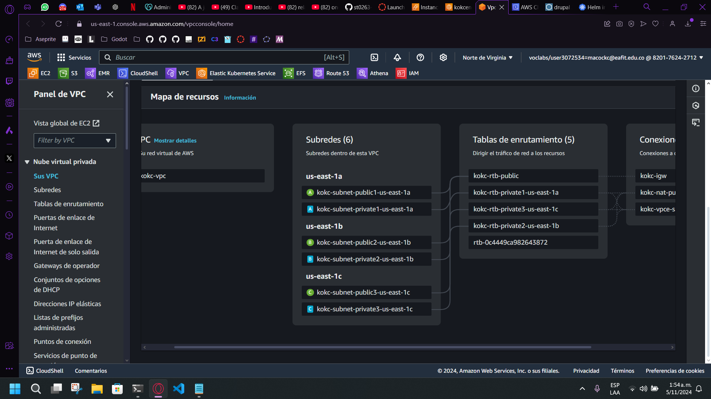
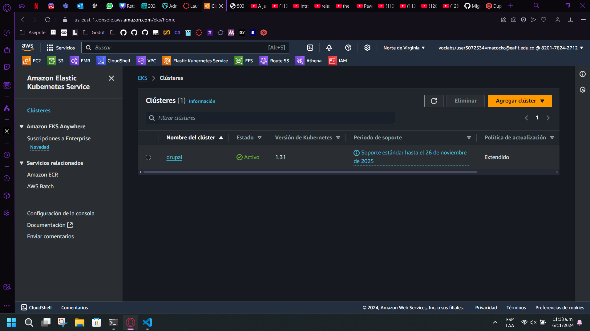
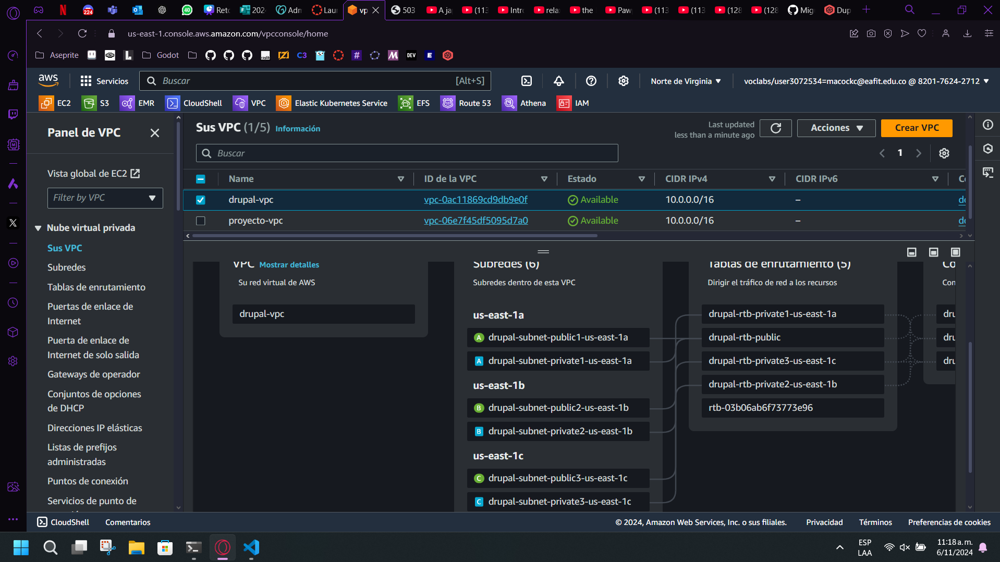
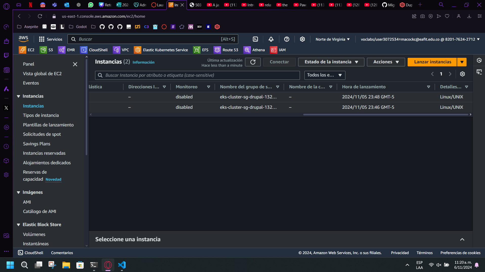
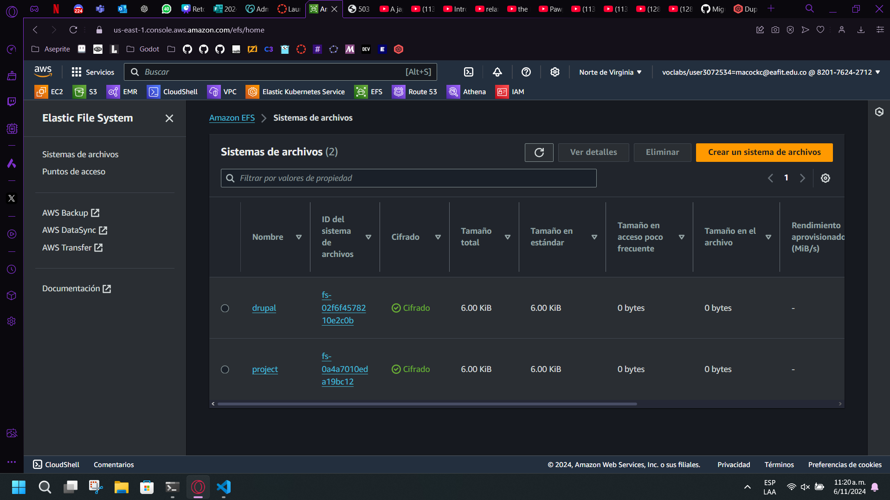
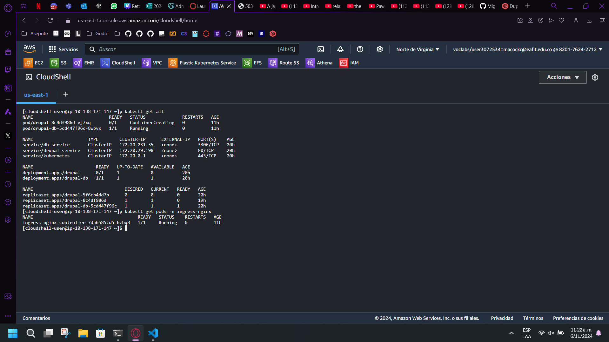
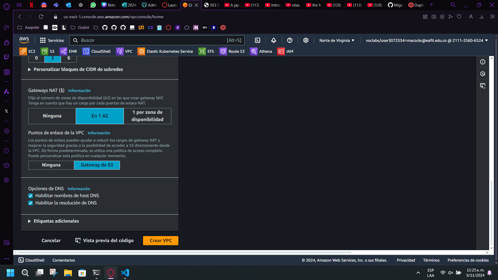
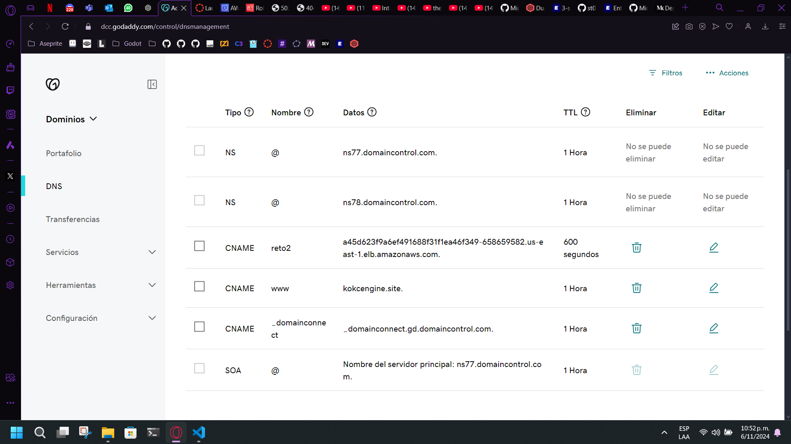
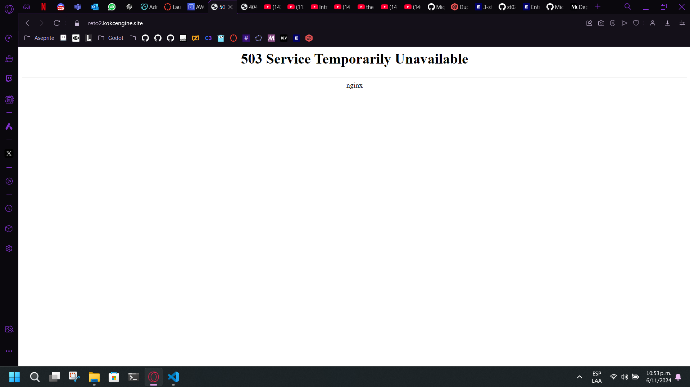
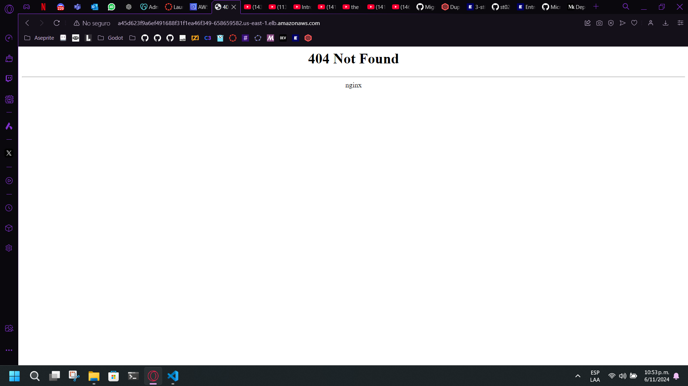

# Reto2 Tópicos Especiales en Telemática

## Tópicos Espec. en Telemática - C2466-ST0263-1716

### Estudiantes:
Miguel Angel Cock Cano

### Profesor: 
Alvaro Enrique Ospina Sanjuan

### Nombre del proyecto, lab o actividad

Tópicos Especiales en Telemática, 2024-2 Reto No 2


### Documentación
## 1. Breve descripción de la actividad

Desplegar un LMS Moodle en un clúster de alta disponibilidad en Kubernetes autoescalado en nube, con su propio dominio y certificado SSL. El sitio lo llamará: reto2.sudominio.tld.

En este reto2 utilizará un nginx COMO BALANCEADOR DE CARGAS (LB) de la capa de aplicación del moodle. Además de lo anterior, se utilizarán 2 servidores adicionales, uno para BASE DE DATOS (DBServer) y otro para ARCHIVOS(FileServer). El DBServer podrá utilizar la BD en docker (recomendado) o nativa. Y el FileServer implementará un NFSServer.

### 1.1. Aspectos cumplidos de la actividad propuesta por el profesor

- **Configuración de infraestructura**:
  - Creación de una **VPC** (Virtual Private Cloud) para gestionar la red y los recursos de AWS.
  - Implementación de **EFS** (Elastic File System) para el almacenamiento compartido.
  - Configuración y despliegue de **EKS** (Elastic Kubernetes Service) para orquestar los contenedores en un entorno administrado de Kubernetes.

- **Base de Datos y Servidor Web**:
  - Despliegue y puesta en marcha de **MariaDB** como base de datos para Drupal.
  - Configuración y despliegue de **NGINX** para servir como proxy inverso.

- **Dominio y Conexión con NGINX**:
  - Obtención y configuración de un **dominio**.
  - Conexión del dominio al servicio NGINX, permitiendo el acceso público a los recursos desplegados.

### 1.2. Aspectos no cumplidos de la actividad propuesta por el profesor

- **Despliegue de Drupal**:
  - No se logró lanzar los **pods de Drupal** en Kubernetes, quedando pendiente la implementación completa del sistema de gestión de contenidos.

## 2. Información general de diseño de alto nivel, arquitectura, patrones, mejores prácticas utilizadas.

### Diseño de Alto Nivel:

El proyecto Drupal desplegado en AWS EKS (Elastic Kubernetes Service) sigue un diseño modular que separa las responsabilidades entre el front-end y back-end. Drupal actúa como el servidor de aplicaciones y MariaDB como el servidor de base de datos. Se utiliza Kubernetes para la orquestación de contenedores y el manejo del ciclo de vida de las aplicaciones.

#### Arquitectura del Despliegue:

La arquitectura de despliegue consta de los siguientes componentes:
- **EKS Cluster:** Proporciona la infraestructura para gestionar los contenedores.
- **Node Groups:** Grupos de nodos creados para alojar los pods de Kubernetes.
- **Persistent Volumes (PV) y Persistent Volume Claims (PVC):** Utilizados para almacenamiento persistente, configurados con Amazon EFS para Drupal y Amazon EBS para MariaDB.
- **Ingress Controller (NGINX):** Maneja el tráfico HTTP(S) hacia los servicios de Kubernetes.
- **Cert-Manager:** Gestiona los certificados SSL para HTTPS usando Let's Encrypt.
- **Helm:** Utilizado para la gestión de paquetes de Kubernetes, facilita el despliegue de aplicaciones complejas.

#### Patrones de Diseño y Mejores Prácticas:

- **Microservicios:** Separación de aplicaciones en servicios pequeños e independientes.
- **Inmutabilidad:** Los contenedores son inmutables y cualquier cambio se realiza mediante nuevas versiones de las imágenes.
- **Infraestructura como Código:** Utilización de archivos YAML para definir y gestionar la infraestructura.
- **Seguridad:** Uso de HTTPS y certificados SSL para asegurar la comunicación.
- **Escalabilidad:** Configuración de autoscaling para manejar fluctuaciones en la carga.
- **Resiliencia:** Implementación de estrategias de recuperación ante fallos y persistencia de datos.

## 3. Descripción del ambiente de desarrollo y técnico:

### Herramientas y tecnologías utilizadas:

- **AWS EKS (Elastic Kubernetes Service)**
- **Kubernetes**
- **Helm**
- **NGINX Ingress Controller**
- **Cert-Manager**
- **Amazon EFS (Elastic File System)**
- **Amazon EBS (Elastic Block Store)**
- **Docker**
- **Bitnami Docker Images para Drupal y MariaDB**
- **kubectl**
- **nano (Editor de texto)**

### Detalles del desarrollo:

El desarrollo se centra en la creación de archivos de configuración YAML para la gestión de recursos de Kubernetes. Los scripts de configuración y despliegue se ejecutan utilizando `kubectl` y `helm`.

### Ambiente de Desarrollo:

- **Sistema Operativo:** Linux (presumiblemente basado en las herramientas mencionadas).
- **Editor de Texto:** nano para la edición de archivos YAML.
- **CLI de AWS:** Utilizada para gestionar el cluster de EKS.
- **kubectl:** Herramienta de línea de comandos para interactuar con el cluster de Kubernetes.
- **Helm:** Utilizado para la gestión de paquetes de Kubernetes.

### Descripción y configuración de los parámetros del proyecto:

- **Cluster Name:** drupal
- **Node Group Name:** drupal
- **Instance Types:** t3.medium
- **AMI Type:** AL2_x86_64
- **Scaling Configuration:** minSize=1, maxSize=3, desiredSize=2
- **StorageClass:** Configurado para Amazon EFS y EBS
- **PV y PVC:** Definidos para Drupal y MariaDB

## 4. Descripción del ambiente de EJECUCIÓN (en producción):

El ambiente de ejecución se gestiona a través de AWS EKS y Kubernetes. El despliegue incluye la configuración de volúmenes persistentes, servicios de base de datos, controladores de ingreso y certificación SSL.

### Pasos para configurar el ambiente de ejecución:

1. **Actualizar kubeconfig:**
   ```sh
   aws eks --region us-east-1 update-kubeconfig --name drupal
   ```

2. **Crear Node Group:**
   ```sh
   aws eks create-nodegroup --cluster-name drupal --nodegroup-name drupal --node-role arn:aws:iam::211125606524:role/LabRole --subnets subnet-0c638baa7c1e2fc33 subnet-0ce92114bc9bae8b7 subnet-0d83bd8f729c26bf3 --scaling-config minSize=1,maxSize=3,desiredSize=2 --instance-types t3.medium --ami-type AL2_x86_64
   ```

3. **Desplegar el controlador de EFS CSI:**
   ```sh
   kubectl apply -k "github.com/kubernetes-sigs/aws-efs-csi-driver/deploy/kubernetes/overlays/stable/ecr/?ref=release-1.3"
   ```

4. **Instalar Helm:**
   ```sh
   curl https://raw.githubusercontent.com/helm/helm/main/scripts/get-helm-3 | bash
   helm version
   helm repo add stable https://charts.helm.sh/stable
   helm repo update
   ```

5. **Desplegar NGINX Ingress Controller:**
   ```sh
   kubectl apply -f https://raw.githubusercontent.com/kubernetes/ingress-nginx/main/deploy/static/provider/cloud/deploy.yaml
   ```

6. **Configurar StorageClass:**
   ```sh
   kubectl apply -f storage-class.yaml
   ```

7. **Configurar Persistent Volume para Drupal:**
   ```sh
   kubectl apply -f drupal-pv.yaml
   ```

8. **Configurar Persistent Volume Claim para Drupal:**
   ```sh
   kubectl apply -f drupal-pvc.yaml
   ```

9. **Configurar Persistent Volume para MariaDB:**
   ```sh
   kubectl apply -f db-pv.yaml
   ```

10. **Configurar Persistent Volume Claim para MariaDB:**
    ```sh
    kubectl apply -f db-pvc.yaml
    ```

11. **Desplegar Cert-Manager:**
    ```sh
    kubectl apply -f https://github.com/jetstack/cert-manager/releases/download/v1.8.0/cert-manager.yaml
    ```

12. **Configurar ClusterIssuer para Cert-Manager:**
    ```sh
    kubectl apply -f cluster-issuer.yaml
    ```

13. **Configurar Certificate para Drupal:**
    ```sh
    kubectl apply -f drupal-certificate.yaml
    ```

14. **Desplegar la aplicación Drupal:**
    ```sh
    kubectl apply -f deploy.yaml
    ```

15. **Configurar Ingress para Drupal:**
    ```sh
    kubectl apply -f ingress.yaml
    ```

16. **Desplegar la base de datos MariaDB:**
    ```sh
    kubectl apply -f deploy-db.yaml
    ``*

17. **Configurar Service para Drupal:**
    ```sh
    kubectl apply -f service.yaml
    ```

18. **Configurar Service para MariaDB:**
    ```sh
    kubectl apply -f service-db.yaml
    ```

Estos pasos aseguran un despliegue completo y casi funcional del proyecto Drupal en un ambiente de producción gestionado con Kubernetes en AWS EKS.












https://www.canva.com/design/DAGVw4ZtU_k/t3epmrAJcgntU4cM7MWPIg/edit?utm_content=DAGVw4ZtU_k&utm_campaign=designshare&utm_medium=link2&utm_source=sharebutton

## 5. Referencias:

https://github.com/IBM/drupal-nginx-php-kubernetes/blob/master/scripts/kubernetes/ingress/ingress.yaml
https://stackoverflow.com/questions/62887739/mountvolume-setup-failed-for-volume-with-eks-and-efs
https://stackoverflow.com/questions/62447132/mounting-efs-in-eks-cluster-example-deployment-fails
https://kubernetes.io/docs/concepts/services-networking/ingress/
https://medium.com/containerum/how-to-easily-deploy-a-drupal-8-instance-on-kubernetes-b90acc7786b7
https://mariadb.org/start-mariadb-in-k8s/
https://medium.com/@ravipatel.it/deploying-mariadb-on-kubernetes-a-step-by-step-guide-ec2959cc9b1d
https://www.godaddy.com/es
